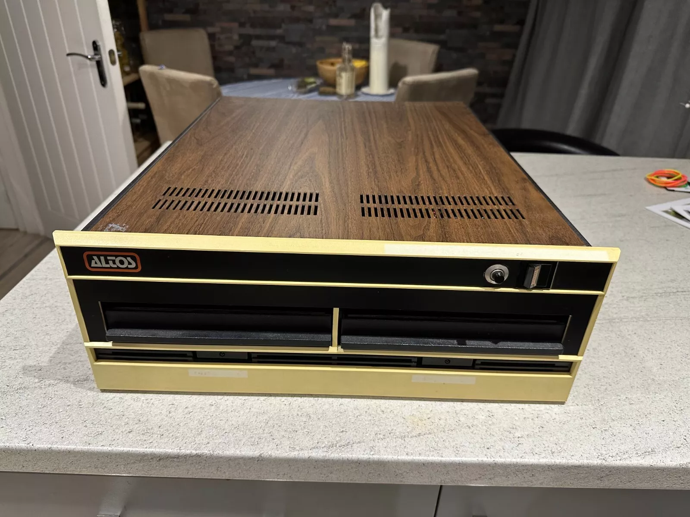
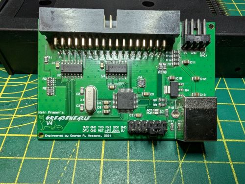

# altos-acs8000
I bought an Altos ACS8000-2 and this is my journey



## Hardware

The ACS8000-2 is a single board Z80 CP/M computer, with two 8 inch Shugart SA-801, with a serial console port at 9600 8bit NoParity 1 stop bit.

The system came without boot disks, so I bought some blank floppies and connected them to a Greaseweazle board via an 50 pin to 34 pin adapter and burnt a boot disk.  See below for software.

[50 pin adapter](https://www.tindie.com/products/siliconinsider/8-floppy-disk-interface-50-pin-to-34-pin-adapter/)


GoTek flashed with [FlashFloppy](https://github.com/keirf/flashfloppy).  Buy your goteks [direct from FlashFloppy's author](https://www.ebay.co.uk/usr/zeroflux?mkcid=1&mkrid=710-53481-19255-0&siteid=3&campid=5338940711&customid=flashfloppy&toolid=10001&mkevt=1) pre-flashed.


HXC


Greaseweazle.  [Buy from Greaseweazle's creator](https://www.ebay.co.uk/usr/zeroflux?mkcid=1&mkrid=710-53481-19255-0&siteid=3&campid=5338940711&customid=flashfloppy&toolid=10001&mkevt=1)



## Software
A CP/M 2.2 boot disk is available for download from [archive.org](https://archive.org/details/Altos_Computer_Systems_ACS_8000_TOSEC_2012_04_23).  
There's four TD0 disk images in there, a CP/M 2.21 Boot and an Altos ACSDiagnostics Disk which can format disks.  There's a DMA and non-DMA version
of each.  Only the non-DMA versions work on the ASC8000.

This [greaseweazle](https://github.com/keirf/greaseweazle) (1.21 or later) command will convert the CPM221 TD0 to a HFE that will boot from the Gotek.  The bitrate is 500kbps.  [FluxMyFluffy](https://github.com/FrankieTheFluff/FluxMyFluffyFloppy) makes a great GUI for gw.  If 250kbps, the disk spins at 180RPM which won't boot.

    gw convert --format dec.rx01 ACS8000_CPM221.td0 ACS8000_CPM221.hfe

My FF\FF.cfg is

    interface=shugart
    host=unspecified
    pin02=nc
    pin34=rdy

I also connected the greaseweazle directly to the Shugart SA-801s and wrote an 8 inch boot floppy.

## Connection

I connected my greaseweazle to the 50 way IDC connector using [this wonderful adapter](https://www.tindie.com/products/siliconinsider/8-floppy-disk-interface-50-pin-to-34-pin-adapter/) featured on [Curious Marc's](https://youtu.be/oL0LXSE1jeM?si=E70dFKGQlqYFbhoz&t=382) and [Adrian Blacks](https://youtu.be/TfEzjcG_0gs?si=2jY0N0QAEGCFDjhS&t=1020) videos on connecting 8" floppies to 34 pin cables.

I can also swap this out for the GoTek, or also a Lotharek HXC USB Floppy Emulator (read only).  

I wasted a lot of time with the HxcFloppyEmulator converting images from varying formats to .hfe, and would recommend using GreaseWeazle to convert formats as well as burn and read physical media.  The Gotek is more flexible than the USB Emulator as it's not read only.

## Boot Screens

```
32K ALTOS LOADER VERS 2.21

32K ALTOS DOS VERS 2.21

A>dir
A: MOVCPM   COM : CBIOS32  COM : CBIOS48  COM : CBIOS64  COM
A: PIP      COM : SUBMIT   COM : XSUB     COM : ED       COM
A: ASM      COM : DDT      COM : LOAD     COM : STAT     COM
A: SYSGEN   COM : DUMP     COM : DUMP     ASM : BOOT221  ASM
A: C221LDRB ASM : CBIOS221 ASM : DEBLOCK  ASM : DISKDEF  LIB
A: Z80S     LIB : MODE     COM : CPMSETUP COM
A>
```

Also available is a diagnostic disk.  You'll need this to format floppies.

```
32K ALTOS DOS VERS 1.11

ALTOS DIAGNOSTIC MONITOR VERS 1.1

  ***   D I A G N O S T I C   C O M M A N D   D I R E C T O R Y   ***

        ADXSETUP        COPY            DCOPY           FLPYFORM
        FLPYTEST        MEMTEST         PRNTEST         BOOTCOPY


REQUEST: FLPYFORM


.... ALTOS FLOPPY DISK FORMAT ROUTINE ....
           VERSION 1.11

1.  STANDARD SINGLE DENSITY FORMAT
2.  DOUBLE DENSITY FORMAT FOR CP/M AND DIAGNOSTIC DISKS
3.  DOUBLE DENSITY FORMAT FOR MP/M
4.  END THIS PROGRAM

SELECT FORMAT OPTION BY NUMBER 1


PLACE DISK TO BE FORMATTED IN AVAILABLE DRIVE
REMOVE DIAGNOSTIC DISK IF NECESSARY.
WHEN READY TO PROCEED,
REPLY WITH DRIVE LETTER ("A", "B", "C" OR "D"). A

DISK IN A: HAS BEEN SUCCESSFULLY FORMATTED
```
